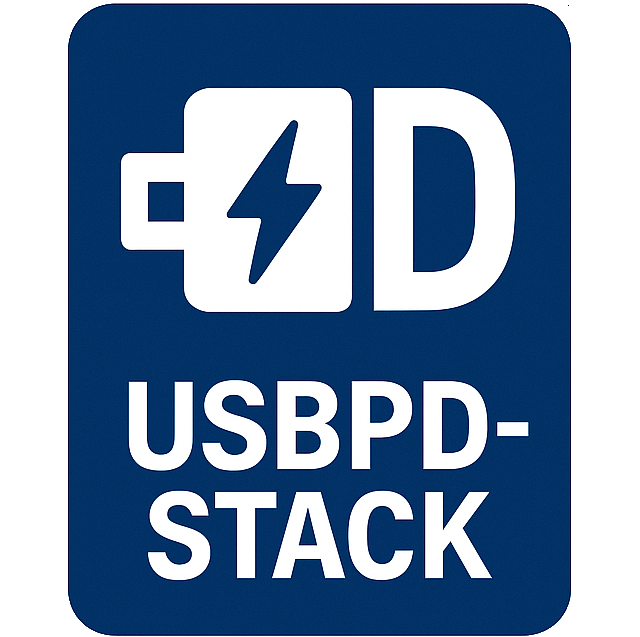
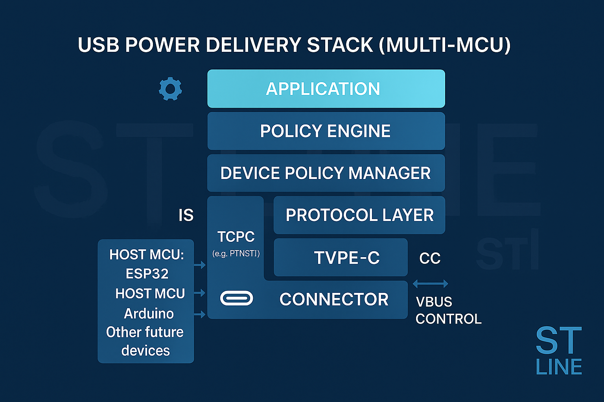

# USB Power Delivery Stack for PTN5110

<!-- markdownlint-disable-next-line MD033 -->


Open-source distribution of the NXP MCUXpresso USB Power Delivery stack with a modern
build system, portable HAL adapters, and multi-platform examples maintained by
**Stefano Fante** (STLINE SRL).

Originally derived from MCUXpresso middleware 25.06.00, this repository keeps the
proven PTN5110 Type-C Port Controller (TCPC) driver while providing a streamlined
structure for contemporary embedded toolchains.

## Highlights

- PD 2.0 / 3.0 policy engine with PTN5110 TCPC support
- Drop-in FreeRTOS adapters for ESP32-S3 and STM32 (Cube HAL)
- Cooperative Arduino port based on `TwoWire` and lightweight critical sections
- Header-only HAL abstraction layer (`support/include`) for GPIO, I²C, and OS primitives
- PlatformIO-ready layout with configurable target selection via `usb_pd_config.h`
- Dual licensing: original NXP sources under BSD-3-Clause, STLINE additions under MIT

## Supported Targets

| Target                 | Transport           | Status | Notes                                                                  |
|------------------------|---------------------|--------|------------------------------------------------------------------------|
| ESP32-S3 (ESP-IDF)     | FreeRTOS + HAL      | Stable | 1 kHz timer driven by shared FreeRTOS software timer                   |
| STM32 F3/F4/H7         | FreeRTOS + Cube HAL | Stable | EXTI-based ALERT handling, configurable I²C timeout                    |
| Arduino (AVR/ESP/NXP)  | Cooperative loop    | Beta   | Uses `TwoWire`; call `PD_PortArduino_TaskTick()` from the main loop    |

Select exactly one `PD_CONFIG_TARGET_*` macro before compiling (see
`include/usb_pd_config.h`). Each platform ships with a `pd_phy_<platform>_config_t`
that describes the required MCU resources.

## Repository Layout

```text
├── include/        # Core stack public headers (policy engine, configs, types)
├── port/
│   ├── include/    # Platform-facing port APIs (tick helpers, init hooks)
│   └── src/        # Port orchestration (scheduler glue per platform)
├── support/
│   ├── include/    # HAL abstraction headers (GPIO, I²C, OS wrappers)
│   └── src/        # HAL bindings implementing the abstractions
├── src/            # Core C sources (policy engine, timers, alt modes)
├── third_party/
│   └── nxp_pd/
│       ├── include # Upstream NXP headers (BSD-3-Clause)
│       └── src     # Upstream PTN5110 driver and shared HAL code
├── docs/           # Usage guide and Ellisys compliance reports
├── CHANGELOG.md
├── TODO.md
└── LICENSE
```



## Getting Started

### PlatformIO

The repository includes a `library.json`, so PlatformIO can consume it directly.
Declare the library in `lib_deps` or add it as a git submodule and reference it
locally. Example configuration:

```ini
[env:esp32s3]
platform    = espressif32
framework   = espidf
board       = esp32s3dev
build_flags = -DPD_CONFIG_TARGET_ESP32S3=1

[env:stm32h743]
platform    = ststm32
framework   = stm32cube
board       = disco_h743zi
build_flags = -DPD_CONFIG_TARGET_STM32=1
```

### Manual / CMake Integration

1. Add the repository as a submodule or fetch it into your source tree.
2. Define exactly one target macro (`PD_CONFIG_TARGET_ESP32S3`, `PD_CONFIG_TARGET_STM32`,
  or `PD_CONFIG_TARGET_ARDUINO`).
3. Add these include paths: `include/`, `port/include`, `support/include`, and
  `third_party/nxp_pd/include`.
4. Compile the source directories: `src/`, `port/src`, `support/src`, and
  `third_party/nxp_pd/src`.
5. Fill the `pd_phy_<platform>_config_t` structure with board-specific details and
  pass it to `PD_InstanceInit`.
6. Run the matching tick helper (FreeRTOS timers for ESP32/STM32 or
  `PD_PortArduino_TaskTick()` from the Arduino main loop).

## Configuration

All configuration options live in `include/usb_pd_config.h`. Beyond target selection,
notable flags include:

- `PD_CONFIG_MAX_PORT` – number of simultaneous PD ports
- `PD_CONFIG_ALT_MODE_SUPPORT` / `PD_CONFIG_ALT_MODE_DP_SUPPORT` – enable
  DisplayPort alt mode helpers
- `PD_CONFIG_PD3_PPS_ENABLE` – toggle Programmable Power Supply support
- `PD_CONFIG_SOURCE_ROLE_ENABLE` / `PD_CONFIG_SINK_ROLE_ENABLE` – restrict the
  advertised power/data roles
- `PD_CONFIG_PD3_FAST_ROLE_SWAP_ENABLE` – opt-in to Fast Role Swap

## Documentation

- `docs/library_usage.md` – step-by-step integration guide
- `docs/compliance_test_report/` – Ellisys captures from the original NXP stack
- `CHANGELOG.md` – release notes and restructuring history
- `TODO.md` – upcoming work (FUSB302B port, compliance regression testing)

## Roadmap

- Implement a FUSB302B TCPC port layer with ALERT handling helpers
- Refresh Ellisys compliance reports for the newly supported platforms
- Publish ready-to-build example projects showcasing each target

Contributions tackling the items above are very welcome—open an issue to discuss
your plan before submitting a pull request.

## Contributing

1. Fork the repository, create a feature branch, and follow the existing code style.
2. Add or update tests/examples where possible.
3. Run static analysis or builds for the affected targets.
4. Submit a pull request against the `develop` branch with a clear description of the change.

Feel free to open issues for bugs, feature proposals, or integration questions.

## License

The codebase is dual-licensed:

- **BSD-3-Clause** for the original NXP USB PD stack sources located in
  `third_party/nxp_pd/`.
- **MIT** for the adaptations and new material authored by Stefano Fante / STLINE SRL.

See `LICENSE` for the complete legal text and attribution requirements.

## Acknowledgements

- NXP Semiconductors for the original PTN5110 USB PD implementation
- Contributors and testers across the ESP32, STM32, and Arduino communities

Useful references:

- PTN5110 product page – <https://www.nxp.com/products/interfaces/usb-interfaces/usb-type-c/usb-pd-phy-and-cc-logic/usb-pd-tcpc-phy-ic:PTN5110>
- USB Type-C Port Controller Interface Specification – <https://cache.nxp.com/docs/en/user-guide/UM11056.pdf>
